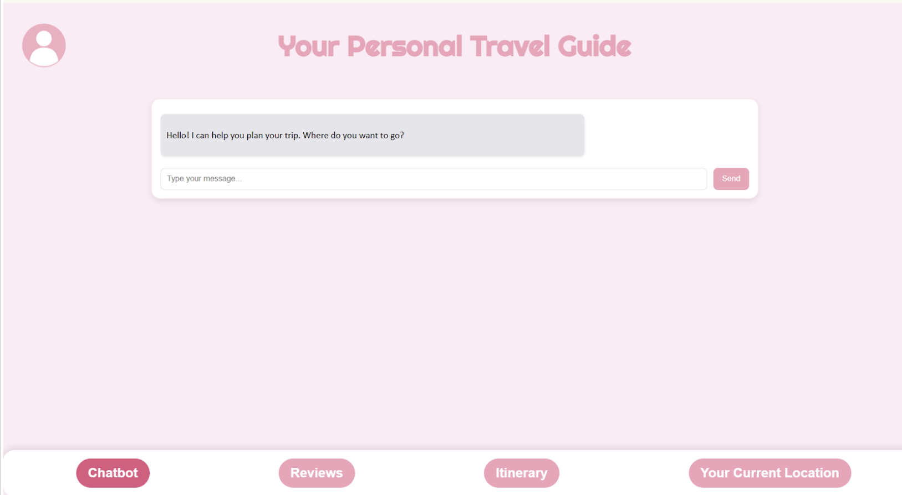
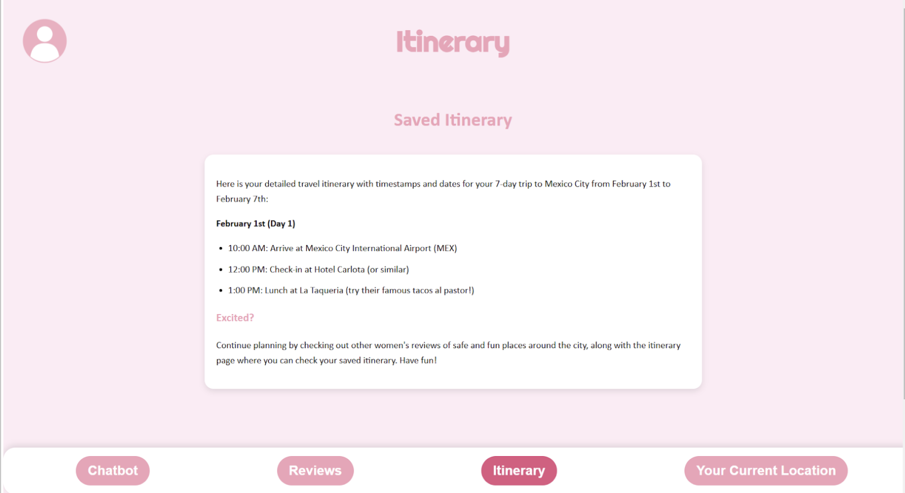
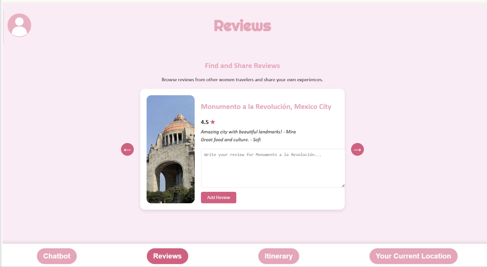

# **TravelHER: Empowering Women to Explore, Connect, and Thrive**

Quick runthrough the pages: 

The AI Chatbot opening page 

The itinerary that is saved from your conversation with your chatbot

The reviews page generated from your conversation with your chatbot

## **Inspiration 💡**
TravelHER was born from the idea of creating a platform that empowers women to explore the world with confidence. We wanted to address the unique challenges women face while traveling, like safety concerns and finding trustworthy recommendations, by building a community-driven platform tailored specifically to their needs.

---

## **What It Does 🚀**
TravelHER provides a comprehensive travel experience that includes:

- **Personalized Itinerary Generator**: Plan your trips easily with a chatbot that creates day-by-day itineraries while considering various factors such as your travel preferences, seasonal weather, and more.
- **Community Reviews**: Browse reviews of destinations and landmarks written by women for women.
- **Interactive Features**: Add your own reviews, rate destinations, and create a shared network of trusted recommendations.
- **Seamless Planning**: Save itineraries, track your schedule, and stay organized—all in one place.

---

## **Challenges We Ran Into 🛠️**

- **Out-of-Scope Ideas**:  
  We struggled with keeping our ideas practical for development, leading to poor time management as we kept getting excited and distracted by more potential features we could add.

- **Pivoting Project Ideas Halfway Through**:  
  After 9 hours of trying to develop an app, we took a step back to analyze our situation and recognized that we were falling victim to the sunk cost fallacy. Instead of clinging to an unproductive direction simply because of the time and effort already invested, we made the tough decision to pivot and refocus on a project that better aligned with our goals and resources.

- **Backend Integration**:  
  Connecting the frontend with the backend while ensuring persistent storage required a lot of debugging and tracing through lines and lines of endless code. The integration process really tested our grit and patience.

- **Responsive Design**:  
  Ensuring that the UI looked aesthetically pleasing across different tabs and features was a surprising challenge for us, especially as we decided to integrate a 3-D three.js sphere object for one of our features.

---

## **Accomplishments That We're Proud Of 🎉**

- Successfully deployed a functional, user-friendly platform integrating **React.js** and **Flask**.
- Implemented a sliding review card system for interactive browsing of community reviews.
- Built a responsive, aesthetically pleasing design using **CSS** to match TravelHER’s vision of empowerment and ease.
- Integrated a fully functional chatbot for travel itinerary generation.

---

## **Soaring to New Heights 🌟**

- **Gain More Users**:  
  We would like to grow the network of people who use our app as this will allow us to gather more data on different locations around the world to be more accurate and up-to-date on safety information for the surrounding area.

- **Refine/Add Features**:  
  For future features, we want our AI chatbot to also:
  - Pick the best travel routes for users based on past crime history.
  - Mark safe zones on the map.
  - Integrate scheduled trip dates into Google Calendar.

---

## **Our Tech Stack 🚀**

### **Back End**
- **Python** and **Flask**: Built the majority of our backend with Flask, a lightweight framework perfect for managing routes and APIs.
- **LangChain** & **Groq API**: Powered our conversational AI chatbot by integrating LangChain, leveraging the advanced Groq API for seamless natural language processing.
- **Development Environment**: Used Replit for collaborative coding and backend prototyping.

### **Front End**
- **React.js**: Enabled us to build a dynamic and responsive user interface.
- **Custom CSS**: Designed the interface with unique styles to align with TravelHER's theme and vision.
